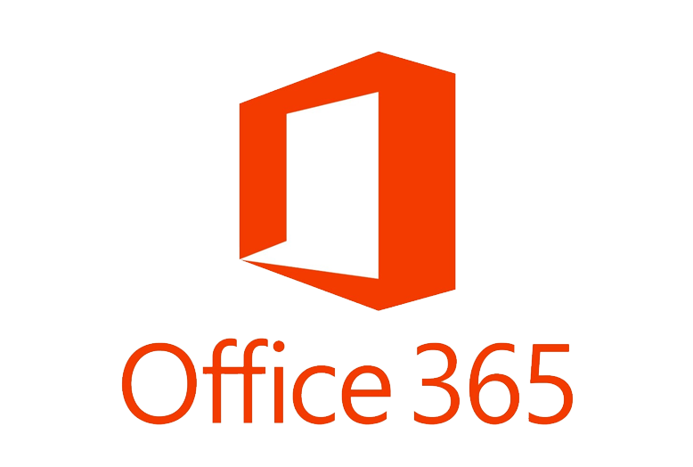
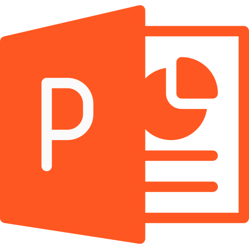

<h1 align="center"> 
  
  𝐇𝐞𝐥𝐥𝐨, 𝐟𝐞𝐥𝐥𝐨𝐰 <𝚍𝚎𝚟𝚎𝚕𝚘𝚙𝚎𝚛𝚜/>! 
</h1>

  <em>
    Hello, I'm Camilo!  
    I'm Software developer and biomedical engineering , I'm in the process of becoming <b>Full-Stack Web Developer</b>  and a <b>Competitive Programming Enthusiast</b>;, who is in the process of growing as  a person and on the road to professional growth  . 
    
  </em>

> &nbsp;***Talking about Personal Stuffs:***

-   🔭 I’m currently looking for a place where I can grow as a programmer.
-   🌱 I’m currently learning stuff to be a Full-Stack Web Developer!
-   💬 I'm happy to help!
-   ⚡ Fun fact: I like **bonsais and plants, coding, video games and anime, listening to music and dance salsa, eating chips and I think that's about it**. I dislike everything except my likes!

<i><b>GitHub Stats:octocat::</b></i>  
  

<i><b>Languages and software that I know and continue to learn:</b></i> 
 
 
                 

  

<i><b>Tools known:</b></i> 
     
  &nbsp;
  &nbsp;
  &nbsp;
  &nbsp;
  &nbsp;
  &nbsp;
  &nbsp;
  &nbsp;
  &nbsp;  

  <i><b>Profiles:</b></i>  
  <a href="mailto:kmilo8433@gmail.com">
    &nbsp;
  </a>
  <a href="https://www.linkedin.com/in/camilo0">
    &nbsp;
  </a>
  <a href="https://open.spotify.com/user/y9lp3dgc8httjjgv2m7ywiys2">
    &nbsp;
  </a>
  <a href="https://www.instagram.com/camilongarcia">
    &nbsp;
  </a> 

